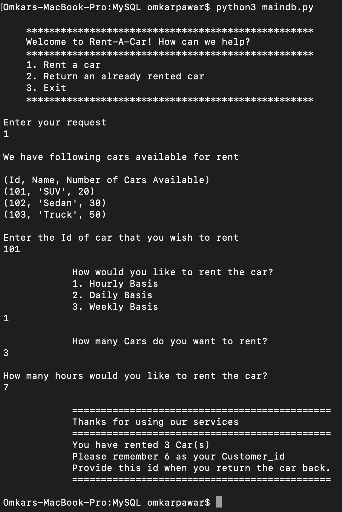
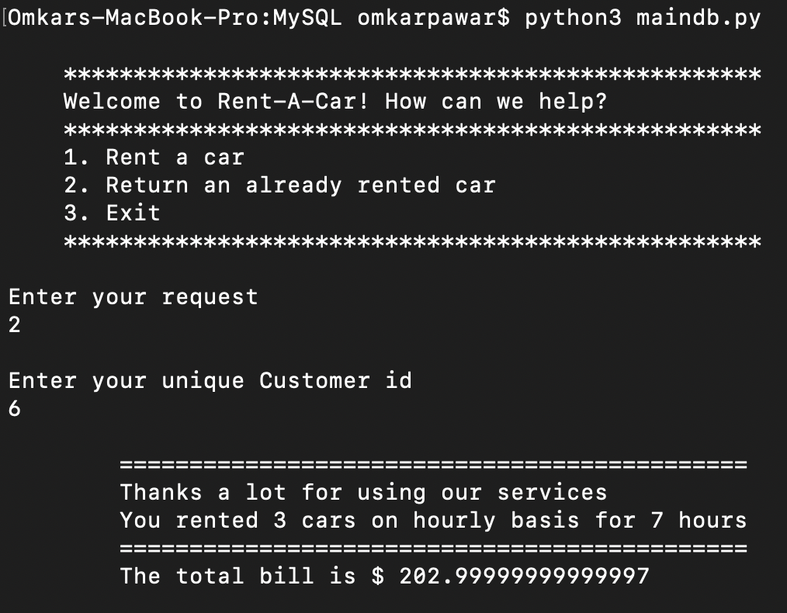

# Rent-A-Car

### Database Approach

In this section, we implement the same problem using MySQL and PyMySQL

To run this script on your machine, make sure you have MYSQL Server and PyMYSQL installed. Refer to the following commands on how to setup the environment.

### MySQL
8.0.20

In MySQL, create Customer and carStore Database as follows.

* use database_name

* create table Customer (cust_id INT, car_rented INT, carTypeid INT, rentType INT, rentPeriod INT, invoice INT);

* create table carStore (car_id INT, carType VARCHAR(20), available_cars INT, cars_rented INT, carPrice INT);

* insert into carStore values (101,'SUV',20,0,35),(102,'Sedan',30,0,40),(103,'Truck',50,0,45);

This would be enough to get started. You can add more rows to carStore as you want.

### PyMySQL

Install PyMYSQL as follows. It is needed to connect the database to your python script.

> pip install pymysql

OR

> pip3 install pymysql

Once everything is setup, run maindb.py file

> python3 maindb.py

#### Application in Action
* Rent Request

* Car Return

